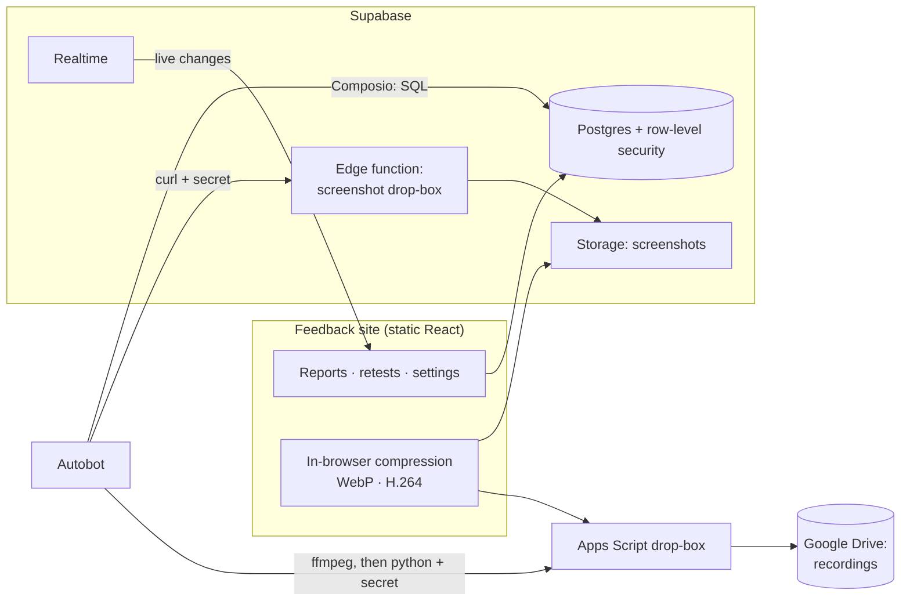

# Autobot Feedback

The Convogenie team's tool for making Autobot, their AI assistant, better, one mistake at a time.

When Autobot gets something wrong, someone on the team logs it. Rahul, who works on the model, fixes it. The person who reported it tries the same thing again and marks whether it actually got better. Every report keeps its evidence and its history, so the team can see what went wrong, what changed, and whether the fix held.

It has been in use at Convogenie since September 2026.


## Why it exists

Feedback used to go to Rahul as screenshots in Slack. That made it hard to answer three simple questions: what was reported, was it fixed, and did the fix work? Messages got buried, the same problem was reported twice, and nobody could say whether Autobot was improving.

## How a report moves

A real example of the loop:

1. Autobot is asked to reply only in Hindi. Four messages later it drafts an offer in English.
2. In the same chat, the reporter tells Autobot **"log this as feedback"**. Autobot drafts the report, *what was expected* and *what went wrong*, shows it, and saves it only after the reporter says yes.
3. Rahul gets a notification, reads the report, ships a change to Autobot's prompt, and marks it **Fixed · needs retest** with the version.
4. The reporter is told to retest. They send Autobot the exact same prompt and record the result: **Pass**, **Partly** or **Fail**.
5. A pass moves it to **Verified**. Anything else sends it back as **Reopened**, and the loop continues.

```
Open → Acknowledged → Fixed · needs retest → Verified
                                          ↘ Reopened
```

A report never counts as fixed because the fixer says so, only because the retest passed.


## What's in it

**For the person reporting**
- Report from the site, or from inside Autobot while the mistake is still on screen.
- Each report leads with two plain sentences, *what was expected* and *what went wrong*. The exact prompt and reply sit folded underneath as evidence.
- Screenshots and screen recordings, compressed in the browser before upload.
- Add updates later without changing the original. Close a report that turns out not to need a fix, or reopen one that comes back.

**For the fixer**
- Only the fixer moves reports between stages. Each fix is recorded with the version it shipped in.
- A notification bell and live updates. New reports, updates and retest results appear without refreshing.
- "Where Autobot struggles": reports grouped by type (forgot context, ignored instructions, made-up facts, tone, tool actions, app bugs…).
- An export of every report as a set of test prompts, to re-run after a change.

**Around it**
- A team list controls who can sign in. Admins add people and copy a ready-made invite.
- Autobot backs everything up to Google Drive every week.
- Light and dark themes, chosen by each person rather than by their computer.

## Decisions along the way

The tool changed a lot once real reports started coming in. Some of the choices:

- **Plain sentences instead of a checklist.** The first version asked for pass/fail "criteria". In practice people wrote their frustration into that box, so it became *what was expected* and *what went wrong*, both written about Autobot in the third person.
- **Autobot asks before it saves.** Its first reports copied the whole conversation into the form. Now it must draft the report, keep one problem per report, and get a yes first.
- **History can be added to, never edited.** Updates, fixes and retests are appended; nothing is overwritten or deleted. The rules live in the database, not just in the buttons.
- **Autobot's instructions live in the database.** Autobot keeps a one-line pointer and fetches its full logging instructions each time. Changing how it logs feedback never means re-pasting a prompt.
- **Free plans only.** Screenshots are shrunk about four times (WebP). Recordings are re-encoded in the browser (a 27 MB Retina recording becomes about 2 MB, with text still sharp) and stored in Google Drive through a small Apps Script, instead of paid storage.
- **Recordings open in Drive, not in the page.** Embedded Drive players ask viewers to sign in again in Brave and Safari, so a recording opens in a new tab instead.

## How it's built

A static React site on Cloudflare Pages, with Supabase behind it, and Autobot connected to the same database through Composio.



| Layer | What's used |
|---|---|
| Site | React 19, TypeScript, Vite, plain CSS (no UI library), hash routing |
| Hosting | Cloudflare Pages (static files) |
| Data & auth | Supabase Postgres, Auth (password or magic link), Storage, Realtime |
| Server code | One Deno edge function (screenshot drop-box) |
| AI connection | [Composio](https://composio.dev)'s Supabase toolkit ("Execute project database query") |
| Media | [Mediabunny](https://mediabunny.dev) (WebCodecs) for video, canvas for images, a Google Apps Script web app for Drive |

### Permissions live in the database

The browser is never trusted to enforce the rules.

- **Who can see anything:** only emails on the `team` table. Every policy goes through `is_team()`, `is_admin()` or `is_fixer()`.
- **Who did what can't be faked:** a `before insert` trigger on the timeline stamps the author from the signed-in session, and rejects stage changes by non-fixers, retests before a fix, and close/reopen on someone else's report.
- **History is append-only:** there are insert and select policies on the timeline and attachments, and no update or delete policies.
- **Autobot's side door is closed to the public:** `log_report`, `add_recording`, `logging_instruction` and `export_all` are revoked from the public API roles. They run only through Composio's server-side connection, including its read-only variant.
- **Uploads need a secret:** the screenshot edge function and the Drive Apps Script each check a shared secret. The site reads the Drive secret only after sign-in, and Autobot gets both through its instruction.

### Media on free tiers

- **Screenshots:** drawn to a canvas, capped at 2880 px wide, and saved as WebP at 0.9 quality. They're kept only if smaller than the original.
- **Recordings:** re-encoded in the browser to H.264 at up to 1728 px, 24 fps and 450 kbps. 300 kbps smeared text while scrolling; 450 didn't. They're then sent as base64 to an Apps Script web app that saves them to a Drive folder shared with the company domain.
- **From Autobot:** the same settings through ffmpeg on its own machine, then the same drop-box.

### Live updates and notifications

- Reports, timeline entries and attachments are in the `supabase_realtime` publication. Pages subscribe and reload their data when something changes; Realtime applies the same row-level security as normal reads.
- The bell compares each change with when you last opened that report (`report_views`). Fixers hear about everything; reporters only about reports they filed or worked on. There's one line per report, and a pending retest always shows first.

### Autobot's instructions, stored as data

`src/instruction.ts` holds the full logging instructions. `scripts/gen-instruction-sql.mjs` turns them into a Postgres function, `logging_instruction()`, that fills in the secrets and drop-box addresses at read time. Autobot's own prompt holds one line: fetch that and follow it.

## Project layout

```
src/
  pages/           Reports (dashboard + table), ReportDetail, NewReport, Settings, Login
  components.tsx   Pills, gallery, screenshot picker, notification bell, account menu
  lib.ts           Supabase client, types, uploads, live updates, theme
  notifications.ts Who should hear about what
  compress.ts      In-browser image and video compression
  drive.ts         Google Drive drop-box: client + the Apps Script source
  instruction.ts   Autobot's logging instructions (stored in the database)
  demo.ts          In-memory stand-in for Supabase, used by `npm run demo`
supabase/          Numbered SQL files (schema → 007) and the screenshot edge function
scripts/           Generates the instruction SQL
```

`npm run demo` runs the whole site on sample data, with no database. Setup notes are in [docs/SETUP.md](docs/SETUP.md).

## Credits

Designed and built by **Amrutha** in about three hours with [Claude Code](https://claude.com/claude-code). Amrutha shaped the product from real use with the Convogenie team: what to capture, who can do what, how it should read and feel. Amrutha also set up and connected every service. Claude wrote the code, the SQL and the tests.
