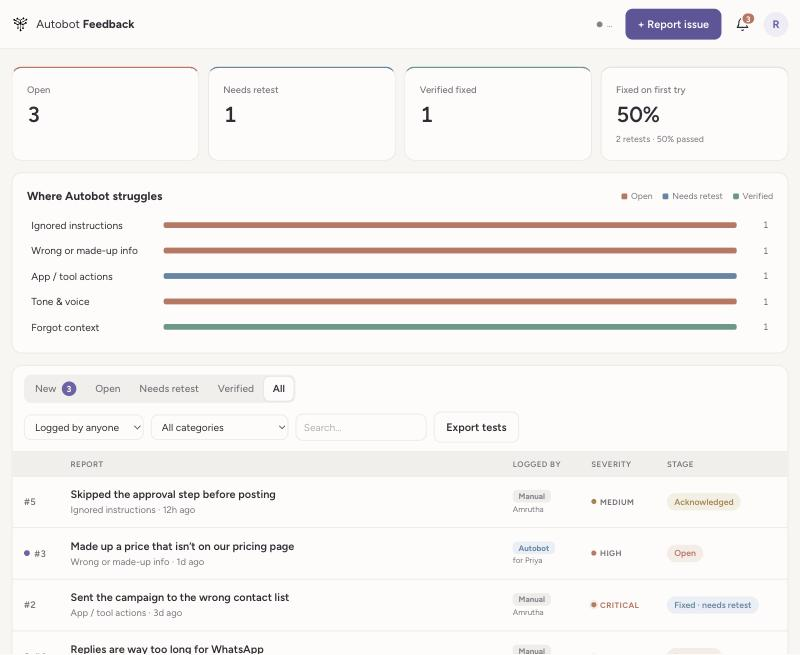
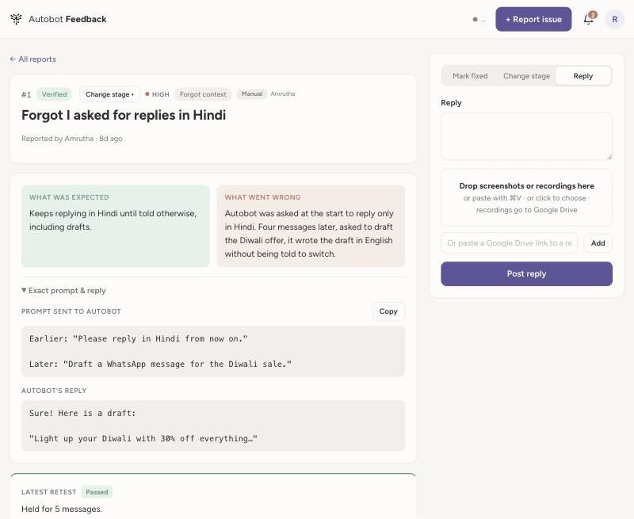
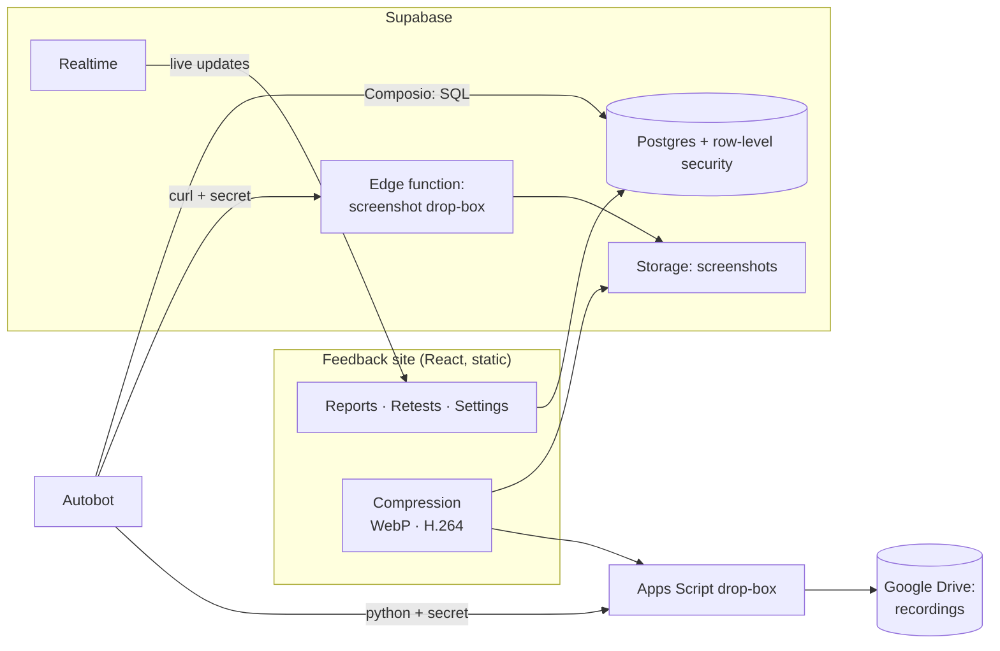

# Autobot Feedback

A small internal tool for improving an AI assistant (Autobot, by Convogenie) with evidence instead of chat threads.

When Autobot gets something wrong, the team logs it, either on the site or by telling Autobot *"log this as feedback"* in the chat where it happened. The fixer (the person who works on the model) moves each report through its stages, and a fix only counts once the reporter **retests it and it passes**. Over time this becomes a record of what went wrong, what was changed, and whether it actually got better.



## Why

Feedback sent over Slack gets lost: nobody can see what was reported, whether it was fixed, or whether the fix held. This tool keeps every report as a small test case:

| Part | Written how |
|---|---|
| **What was expected** | In plain words, about Autobot: *"Autobot should have kept replying in Hindi, including drafts."* |
| **What went wrong** | *"Autobot was asked to reply only in Hindi. Four messages later it drafted the offer in English without being told to switch."* |
| **Exact prompt & reply** | Copied word for word. The prompt is sent again when retesting. |
| **Screenshots & recordings** | Compressed in the browser; recordings go to Google Drive. |

## Features

- **Two ways to report:** a form on the site, or Autobot itself (through [Composio](https://composio.dev)'s Supabase tools). Autobot shows a draft and asks before it saves.
- **A retest loop:** Open → Acknowledged → Fixed · needs retest → Verified (or Reopened). Reporters can close their own reports as "no fix needed" and reopen them.
- **Roles, enforced by the database:** only the fixer moves stages; reporters add updates and retest; history can be added to but never edited or deleted.
- **Notifications:** a bell shows what others did since you last looked (fixers see everything, reporters see their own reports), and pages update live.
- **Media without paid storage:** screenshots are converted to WebP (about 4× smaller); screen recordings are re-encoded in the browser (27 MB → 2 MB on a Retina recording, text still sharp) and saved to Google Drive through a tiny Apps Script "drop-box".
- **Self-updating AI instructions:** Autobot keeps one standing line in its prompt and fetches its full logging instructions from the database each time, so changing them needs no re-pasting.
- **Weekly backups:** a scheduled Autobot routine exports everything as JSON to a restricted Drive folder.
- **Light and dark themes** (chosen in Settings, not inherited from the OS), password or email-link sign-in, and a demo mode with sample data.



## How it fits together



- **Frontend:** React + TypeScript + Vite, plain CSS. Hosted as static files (Cloudflare Pages).
- **Backend:** Supabase: Postgres with row-level security, Auth (password and magic link), Storage, Realtime and one Deno edge function.
- **Media:** [Mediabunny](https://mediabunny.dev) for in-browser video encoding (WebCodecs), Google Apps Script for Drive uploads.
- **AI connection:** Composio's Supabase toolkit ("Execute project database query").

### Security model

- Only emails on the `team` table can read anything. Policies call `is_team()`, `is_admin()` and `is_fixer()`.
- Authors, reporters and stage rules are enforced in a `before insert` trigger, so they can't be faked from the browser.
- Functions Autobot uses (`log_report`, `add_recording`, `logging_instruction`, `export_all`) are revoked from the public API roles and only callable through Composio's server-side connection.
- The screenshot drop-box and the Drive drop-box each require a shared secret.

## Set it up yourself

You need free accounts on Supabase and Cloudflare (or any static host), and optionally Google Workspace and Composio.

1. **Database.** Create a Supabase project. In the SQL Editor, run the files in `supabase/` **in order**:
   `schema.sql` → `002_…` → `003_…` → `004_…` → `005_…` → `006_…` → `007_…`.
   Before running them, change the two example emails in `schema.sql` and `002_…` to your own team.
2. **Keys.** Copy `.env.example` to `.env` and add your project URL and anon (public) key.
3. **Run it:**
   ```bash
   npm install
   npm run dev      # real database
   npm run demo     # sample data, no database needed
   ```
4. **Screenshot drop-box (for the AI):** create an edge function from `supabase/functions/attach-screenshot/index.ts`.
5. **Autobot's instructions:** run `node scripts/gen-instruction-sql.mjs` and paste the generated `supabase/instruction.sql` into the SQL Editor. Then give your assistant the one-line instruction shown in **Settings → Autobot connection**.
6. **Deploy:** `npm run build` and upload the `dist` folder to your static host. In Supabase → Authentication → URL Configuration, add the site's address.
7. **Recordings (optional):** follow **Settings → Google Drive for recordings** (about 3 minutes, no Google Cloud project needed).

## Project layout

```
src/
  pages/          Reports (dashboard + table), ReportDetail, NewReport, Settings, Login
  components.tsx  Pills, galleries, screenshot picker, notification bell, account menu
  lib.ts          Supabase client, types, uploads, live updates, theme
  compress.ts     In-browser image/video compression
  drive.ts        Google Drive drop-box (Apps Script) client + the script itself
  instruction.ts  Autobot's logging instructions (stored in the database)
  notifications.ts
  demo.ts         In-memory stand-in for Supabase used by `npm run demo`
supabase/         Numbered SQL setup files + the screenshot edge function
scripts/          Generates the instruction SQL
```

## Built with Claude

Designed and built by **Amrutha** with [Claude Code](https://claude.com/claude-code). Amrutha shaped the product from real use with the Convogenie team (what to capture, who can do what, how it should read and feel), and set up and connected every service; Claude wrote the code, the SQL and the tests.
